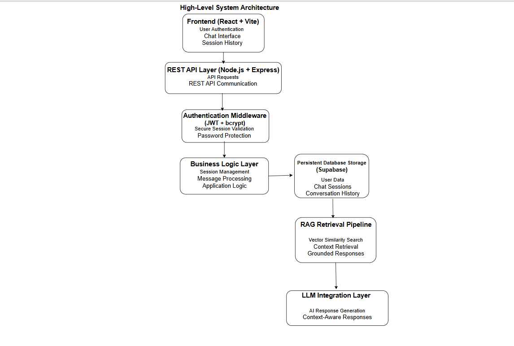
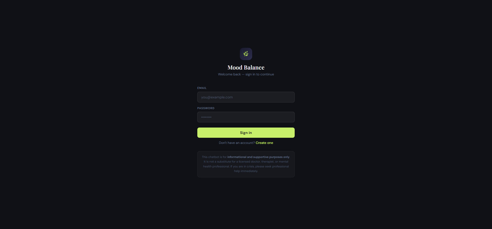
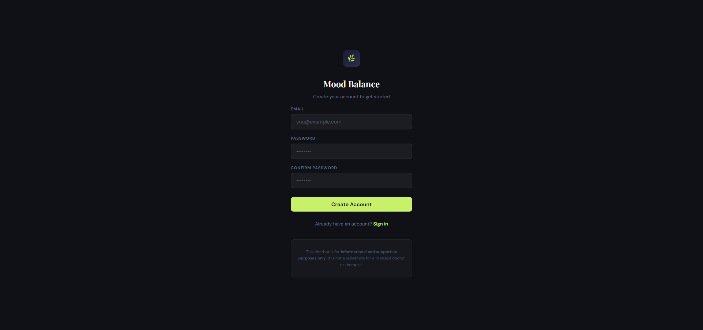
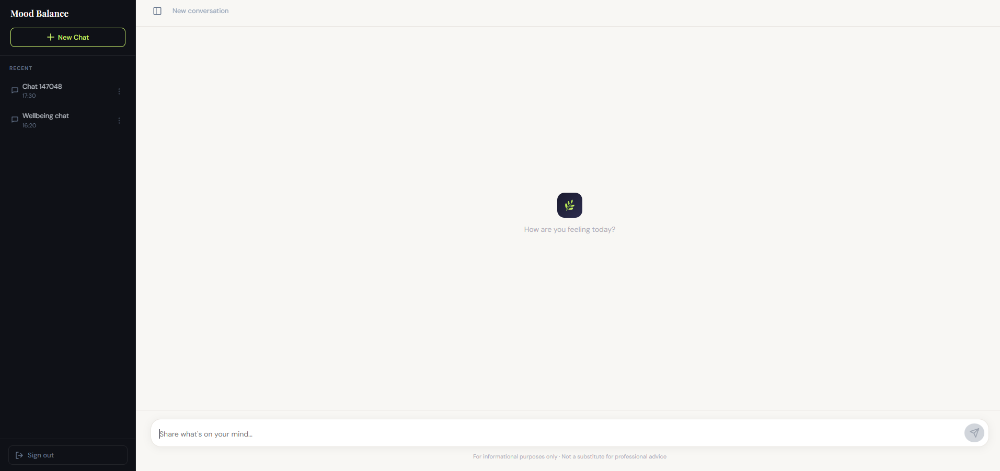
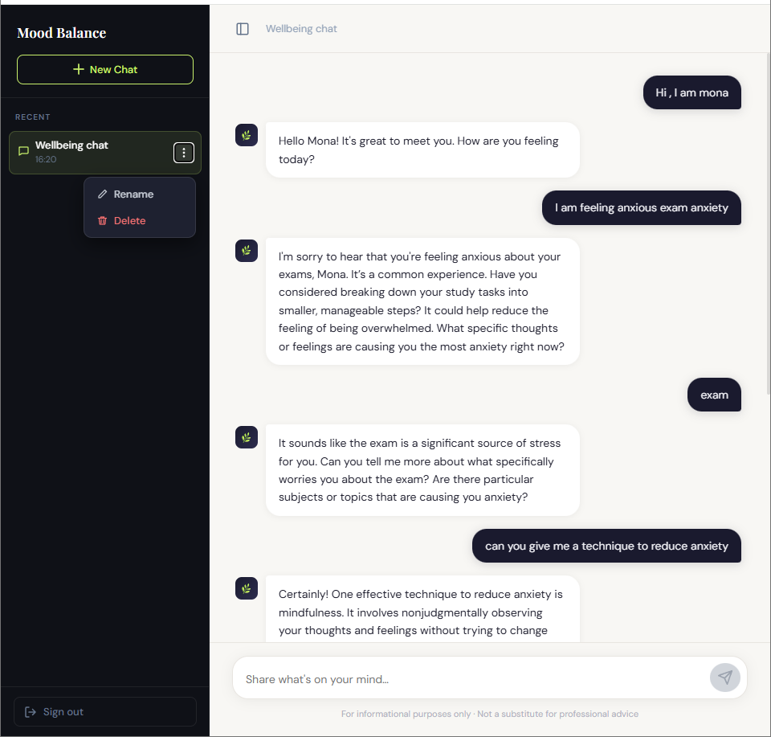
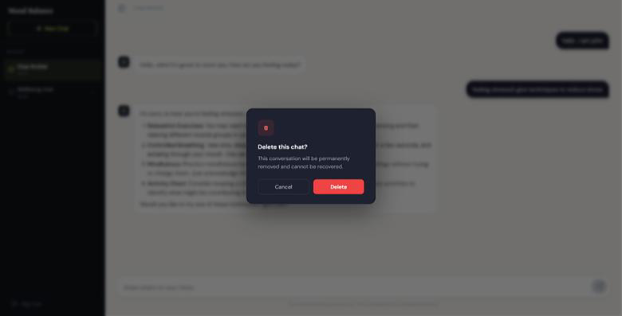

# Mental Wellbeing Chatbot Portfolio

A fullstack AI-assisted mental wellbeing web application developed as an academic honours project under faculty supervision.

This repository is a public portfolio showcase focused on the system architecture, engineering decisions, workflows, and project learnings behind the application.

Due to NDA and academic project restrictions, the source code and confidential implementation details are intentionally not included.

---

# Project Overview

This project focused on building a secure and user-friendly mental wellbeing chatbot web application designed to provide grounded and context-aware supportive conversations.

The goal of the application was to:
- provide accessible mental wellbeing support resources
- maintain secure multi-user interactions
- generate safer and more reliable AI responses
- preserve user session history
- encourage ethical AI-assisted interactions

The chatbot clearly communicated that it does not replace licensed healthcare professionals or psychological services.

---

# Key Features

## Secure Authentication System
Instead of relying entirely on third-party authentication services, the project implemented a custom authentication workflow using:
- JWT token validation
- middleware authorization
- bcrypt password hashing and salting
- cookie-based session handling

Users were able to:
- register accounts
- securely log in
- maintain persistent sessions
- delete accounts
- manage chat sessions safely

User-specific data was isolated securely within the multi-user system.

---

## AI Chat Functionality
The application allowed users to:
- start conversations with an AI assistant
- rename chat sessions
- delete chat sessions
- revisit persistent chat history across sessions

The interface was intentionally designed to remain simple and minimal for accessibility and usability.

---

## Retrieval-Augmented Generation (RAG)
The chatbot used a Retrieval-Augmented Generation (RAG) workflow to improve response grounding and reduce hallucinated responses.

High-level workflow:
1. Mental wellbeing reference material was divided into smaller text chunks
2. Text chunks were converted into vector embeddings
3. User queries were converted into embeddings
4. Similarity search retrieved the most relevant contextual information
5. Retrieved context was injected into augmented prompts
6. The language model generated grounded responses using the retrieved context

The chatbot was intentionally restricted to responding within authorized mental wellbeing-related contexts.

---

# System Architecture

The application followed a modular layered architecture separating:
- frontend UI
- backend APIs
- routing logic
- controller logic
- service-layer business logic
- authentication middleware
- database interactions

This structure improved:
- maintainability
- debugging
- scalability
- component isolation
- testing workflows

REST APIs were used to connect the frontend and backend systems.

---

## High-Level Architecture Diagram

The application followed a modular layered architecture separating frontend interaction, backend APIs, authentication workflows, persistent storage, and AI-assisted retrieval pipelines.

This structure improved maintainability, scalability, testing workflows, and component isolation.



---

# Technology Stack

## Frontend
- React
- Vite

## Backend
- Node.js
- Express.js

## Database
- Supabase

## Security
- JWT Authentication
- bcrypt hashing and salting
- cookie-based session handling
- middleware authorization
- environment variable configuration
- CORS configuration

## AI Concepts
- Retrieval-Augmented Generation (RAG)
- Vector embeddings
- Semantic similarity search
- Context grounding

---

# My Contributions

My primary contributions included:
- backend API integration
- authentication and authorization workflows
- JWT token handling
- middleware implementation
- service-layer business logic
- password encryption workflows
- frontend-to-backend API communication
- secure multi-user session handling
- testing and debugging workflows
- modular backend architecture integration

I also collaborated closely on:
- system architecture discussions
- sprint planning
- testing workflows
- debugging
- feature integration

The frontend UI implementation and major RAG implementation work were collaborative efforts completed with significant teamwork and learning throughout the project lifecycle.

---

# Development Process

The project was developed collaboratively in a two-person team using an iterative sprint-style workflow.

Development practices included:
- modular incremental development
- component-level testing before integration
- collaborative debugging
- agile-inspired sprint workflows
- architecture discussions
- iterative feature refinement

AI-assisted tools were also used to support parts of frontend development and workflow acceleration.

---

# Deployment Overview

The application was initially deployed using:
- Netlify (frontend hosting)
- Render (backend hosting)

The deployment workflow later evolved toward a more containerized deployment setup.

While deployment responsibilities were collaborative, the project provided exposure to:
- frontend/backend hosting workflows
- deployment troubleshooting
- environment configuration
- cloud deployment concepts

---

# Ethical Design Considerations

The application included clear disclaimers communicating that:
- the chatbot does not replace professional healthcare services
- responses are limited to authorized mental wellbeing-related contexts
- the platform exists as a supportive educational and wellness tool

The project prioritized:
- grounded responses
- user privacy
- ethical AI interactions
- responsible response generation

---

# Key Learnings

This project strengthened understanding of:
- fullstack application architecture
- backend engineering
- secure authentication systems
- modular software design
- REST API communication
- AI-assisted application workflows
- Retrieval-Augmented Generation (RAG)
- collaborative software development
- sprint-based development workflows
- engineering tradeoff decisions
- ethical AI-assisted systems

---

# Future Improvements

Potential future improvements include:
- multilingual support
- improved personalization
- mobile optimization
- enhanced retrieval ranking
- expanded wellbeing knowledge integration
- improved deployment workflows

---

# Application Screenshots

## Login Interface
Secure login workflow with custom authentication and session handling.



---

## Registration Interface
User registration workflow with secure password handling and account creation.



---

## AI Chat Interface
Persistent AI-assisted conversation interface with grounded responses and session history.



---

## Session Management
Users could create, rename, revisit, and delete chat sessions while maintaining persistent conversation history.



---

## Session Deletion Workflow
Secure deletion workflow for managing user-specific chat history.



---

## Domain-Constrained Responses
The chatbot was intentionally designed to respond only within authorized mental wellbeing-related contexts to encourage safer and more grounded AI interactions.


---

# Repository Disclaimer

This repository intentionally excludes:
- source code
- API keys
- deployment configurations
- datasets
- internal implementation details
- protected academic materials

This repository exists strictly for portfolio and educational demonstration purposes.
```
