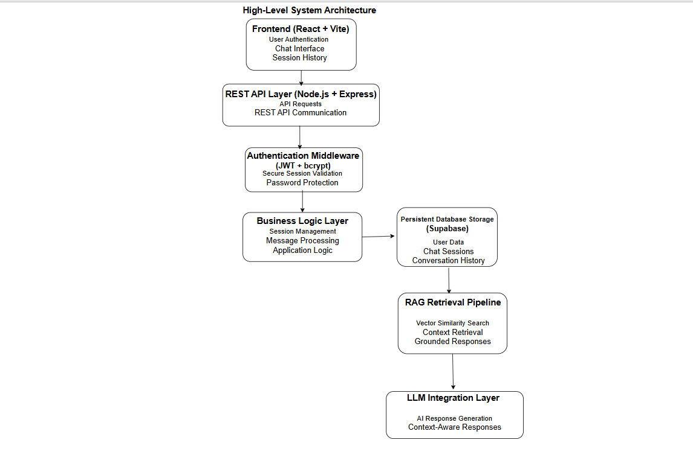
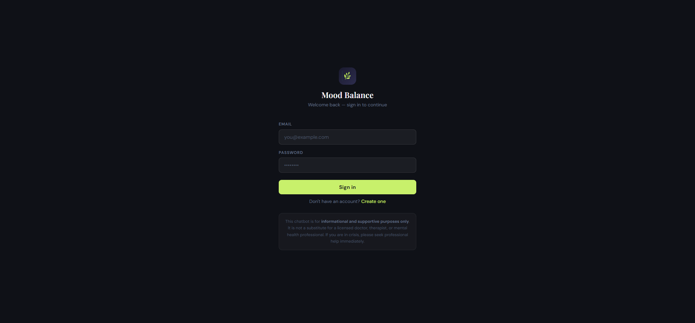
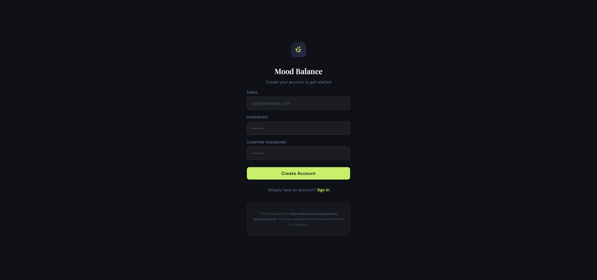
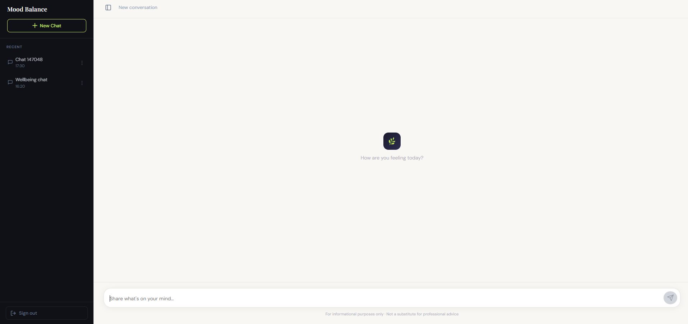
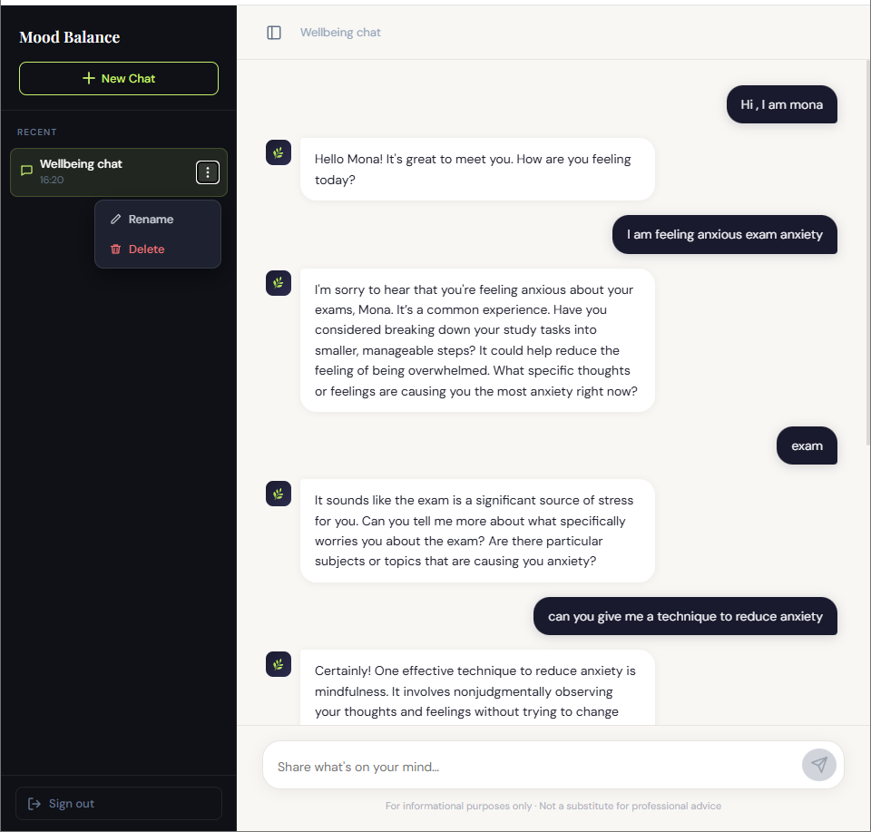
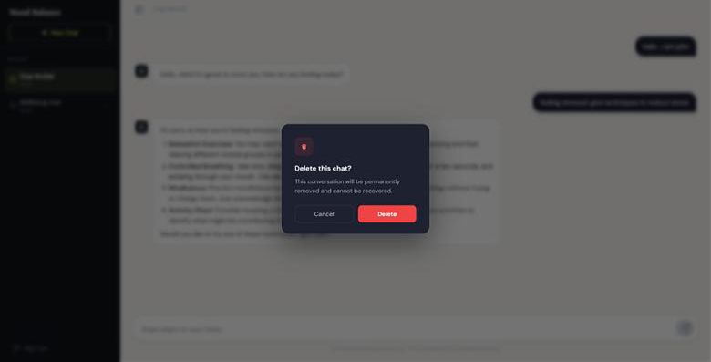

# Mental Wellbeing Chatbot Portfolio

A fullstack AI-assisted mental wellbeing web application developed as an academic honours project under faculty supervision.

This repository is a public portfolio showcase focused on the system architecture, engineering decisions, workflows, and project learnings behind the application.

Due to a non-disclosure agreement (NDA) signed with the project supervisor, the source code and confidential implementation details are intentionally not included.

---

# Project Overview

This project focused on building a secure and user-friendly mental wellbeing chatbot web application designed to provide grounded and context-aware supportive conversations.

The goal of the application was to:
- provide accessible mental wellbeing support resources
- maintain secure multi-user interactions
- generate safer and more reliable AI responses
- preserve user session history
- encourage ethical AI-assisted interactions

The chatbot clearly communicated that it does not replace licensed healthcare professionals or psychological services.

---

# Key Features

## Secure Authentication System
Instead of relying entirely on third-party authentication services, the project implemented a custom authentication workflow using:
- JWT token validation
- middleware authorization
- bcrypt password hashing and salting
- cookie-based session handling

Users were able to:
- register accounts
- securely log in
- maintain persistent sessions
- delete accounts
- manage chat sessions safely

User-specific data was isolated securely within the multi-user system.

---

## AI Chat Functionality
The application allowed users to:
- start conversations with an AI assistant
- rename chat sessions
- delete chat sessions
- revisit persistent chat history across sessions

The interface was intentionally designed to remain simple and minimal for accessibility and usability.

---

## Retrieval-Augmented Generation (RAG)
The chatbot used a Retrieval-Augmented Generation (RAG) workflow to improve response grounding and reduce hallucinated responses.

High-level workflow:
1. Mental wellbeing reference material was split into text chunks (we tested and agreed on a chunk size that gave the best retrieval results)
2. Each chunk was converted into a vector embedding and stored in the database
3. Each user query was converted into an embedding with the same model
4. Similarity search compared the query embedding with the stored embeddings by vector distance and retrieved the **top 3** closest chunks
5. The retrieved chunk text and the user's question were combined into a prompt, together with a predefined set of response rules (following guidelines from our professor)
6. The language model generated a grounded response, following those rules and the retrieved context

The chatbot was intentionally restricted to responding within authorized mental wellbeing-related contexts.

---

# System Architecture

The application used a modular, layered architecture, with REST APIs connecting the frontend and backend:

- **Frontend:** React UI, with API calls centralized in a service layer
- **Backend:** routes → controllers → services → repositories, plus authentication middleware
- **Data:** Supabase (PostgreSQL) for users, chat sessions, and messages, plus vector search for retrieval
- **AI:** retrieval-augmented generation (RAG) pipeline feeding grounded context to the language model

Keeping these layers separate made each part easier to debug and test independently.



---

# Technology Stack

## Frontend
- React
- Vite

## Backend
- Node.js
- Express.js

## Database
- Supabase (PostgreSQL, vector search)

## AI
- OpenAI API (embeddings and chat completion)

## Deployment
- Netlify (frontend)
- Render (backend)

## Security
- JWT Authentication
- bcrypt hashing and salting
- cookie-based session handling
- middleware authorization
- environment variable configuration
- CORS configuration

## AI Concepts
- Retrieval-Augmented Generation (RAG)
- Vector embeddings
- Semantic similarity search
- Context grounding

---

# My Contributions

This was a two-person project. My work focused on the **backend authentication and API layer**:

- **Authentication:** JWT generation and verification, bcrypt password hashing, and HTTP-only cookie session handling (`httpOnly`, `secure`, `sameSite`)
- **Auth middleware:** reads the session cookie, verifies the JWT, and attaches the authenticated user to each request
- **REST endpoints and controllers:** registration, login, logout, current-user (`/auth/me`), and chat
- **Database connectivity:** Supabase client configuration, with service-role keys kept server-side only
- **Documentation:** endpoint specifications written as part of the project handoff
- **Testing:** manually tested every feature before each push and deployment, including the RAG pipeline (my partner's implementation) and its domain constraints: I sent off-topic prompts and confirmed the chatbot stayed in scope (see the *Domain-Constrained Responses* screenshot)
- **Code review:** reviewed my partner's AI-assisted frontend and RAG code before integration

## Debugging highlight: cross-origin session cookies
After deployment, login returned **200 OK** and set a cookie, but the next `/auth/me` request returned **401 Unauthorized**. Using browser DevTools (request/response headers, `Set-Cookie` behaviour, network inspection), I traced the cause: the Netlify frontend and the Render backend were on different domains, so browser cross-site cookie policies blocked the session cookie, even with `SameSite=None; Secure`. I fixed it by routing frontend requests through a Netlify `/api` proxy to the Render backend, which made the requests same-origin.

More detail: [challenges-and-solutions.md](challenges-and-solutions.md) · [security-design.md](security-design.md) · [engineering-decisions.md](engineering-decisions.md)

## Partner's work
My project partner implemented the frontend UI and the RAG pipeline (chunking, embeddings, vector retrieval), using AI-assisted coding tools. RAG was an optional extension in the project's fourth and final milestone, which we added for learning. I learned the concepts through course instruction and her walkthrough of the implementation, agreed with her on the chunk size, and reviewed and tested the pipeline, but I did not build it.

---

# Development Process

The project was developed collaboratively in a two-person team using an iterative sprint-style workflow.

Development practices included:
- modular incremental development
- component-level testing before integration
- collaborative debugging
- agile-inspired sprint workflows
- architecture discussions
- iterative feature refinement

My partner used AI-assisted coding tools to build the frontend and the RAG component. I reviewed and tested that code before it was integrated.

---

# Deployment Overview

The application was initially deployed using:
- Netlify (frontend hosting)
- Render (backend hosting)

The final version of the application was containerized with Docker for deployment.

While deployment responsibilities were collaborative, the project provided exposure to:
- frontend/backend hosting workflows
- deployment troubleshooting
- environment configuration
- cloud deployment concepts

---

# Ethical Design Considerations

The application included clear disclaimers communicating that:
- the chatbot does not replace professional healthcare services
- responses are limited to authorized mental wellbeing-related contexts
- the platform exists as a supportive educational and wellness tool

The project prioritized:
- grounded responses
- user privacy
- ethical AI interactions
- responsible response generation

---

# Key Learnings

This project strengthened understanding of:
- fullstack application architecture
- backend engineering
- secure authentication systems
- modular software design
- REST API communication
- AI-assisted application workflows
- Retrieval-Augmented Generation (RAG)
- collaborative software development
- sprint-based development workflows
- engineering tradeoff decisions
- ethical AI-assisted systems

---

# Future Improvements

Potential future improvements include:
- multilingual support
- improved personalization
- mobile optimization
- enhanced retrieval ranking
- expanded wellbeing knowledge integration
- improved deployment workflows

---

# Application Screenshots

## Login Interface
Secure login workflow with custom authentication and session handling.



---

## Registration Interface
User registration workflow with secure password handling and account creation.



---

## AI Chat Interface
Persistent AI-assisted conversation interface with grounded responses and session history.



---

## Session Management
Users could create, rename, revisit, and delete chat sessions while maintaining persistent conversation history.



---

## Session Deletion Workflow
Secure deletion workflow for managing user-specific chat history.



---

## Domain-Constrained Responses
The chatbot was intentionally designed to respond only within authorized mental wellbeing-related contexts to encourage safer and more grounded AI interactions.


---

# Repository Disclaimer

This repository intentionally excludes:
- source code
- API keys
- deployment configurations
- datasets
- internal implementation details
- protected academic materials

This repository exists strictly for portfolio and educational demonstration purposes.
```
